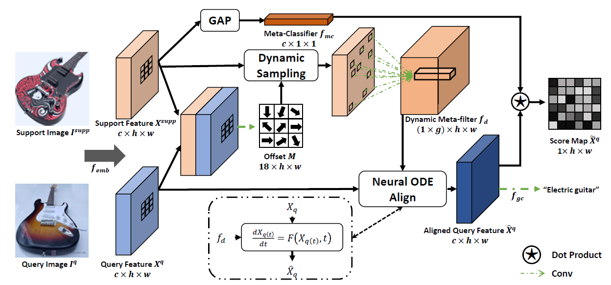
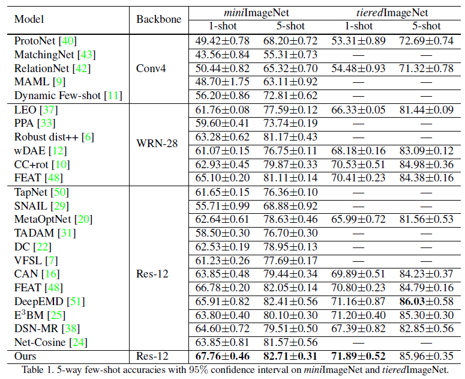

# Learning Dynamic Alignment via Meta-filter for Few-shot Learning
This is an official implementation in PyTorch of DMF. Our paper is available at https://arxiv.org/pdf/2103.13582




## Abstract
Few-shot learning (FSL), which aims to recognise new classes by adapting the learned knowledge with extremely limited few-shot (support) examples, remains an important open problem in computer vision. Most of the existing methods for feature alignment in few-shot learning only consider image-level or spatial-level alignment while omitting the channel disparity. Our insight is that these methods would lead to poor adaptation with redundant matching, and leveraging channel-wise adjustment is the key to well adapting the learned knowledge to new classes. Therefore, in this paper, we propose to learn a dynamic alignment, which can effectively highlight both query regions and channels according to different local support information. Specifically, this is achieved by first dynamically sampling the neighbourhood of the feature position conditioned on the input few shot, based on which we further predict a both position-dependent and channel-dependent Dynamic Meta-filter. The filter is used to align the query feature with position-specific and channel-specific knowledge. Moreover, we adopt Neural Ordinary Differential Equation (ODE) to enable a more accurate control of the alignment. In such a sense our model is able to better capture fine-grained semantic context of the few-shot example and thus facilitates dynamical knowledge adaptation for few-shot learning.
The resulting framework establishes the new state-of-the-arts on major few-shot visual recognition benchmarks, including miniImageNet and tieredImageNet.

## Performance


## Getting Started

### Environment
- PyTorch == 1.4.0 **(Please make sure your pytorch version is 1.4)**
- torchdiffeq == 0.1.1

### Setup
```shell script
pip install -r requirements.txt
python setup.py install
```
### Data Preparation
We use the same data format as [Cross Attention Network](https://github.com/blue-blue272/fewshot-CAN).

### Training & Inference
```shell script
# train on miniImageNet
python train.py --root {data root} --groups {64/160/320/640} --nExemplars {1/5}

# test on miniImageNet
python test.py --root {data root} --resume {checkpoint path} --groups {64/160/320/640}  --nExemplars {1/5}

# train on tieredImageNet
python train_tiered.py --root {data root} --groups {64/160/320/640} --nExemplars {1/5}

# test on tieredImageNet
python test_tiered.py --root {data root} --resume {checkpoint path} --groups {64/160/320/640}  --nExemplars {1/5}
```
The pretrained model weights can be downloaded from [here](https://drive.google.com/drive/folders/1kDVMxXOmR0xJgA2MirMF-PVRd_svA6MP?usp=sharing).

## Citation
If you find this project useful for your research, please use the following BibTeX entry.
```
@inproceedings{xu2021dmf,
  title={Learning Dynamic Alignment via Meta-filter for Few-shot Learning},
  author={Chengming Xu and Chen Liu and Li Zhang and Chengjie Wang and Jilin Li and Feiyue Huang and Xiangyang Xue and Yanwei Fu},
  booktitle={Proceedings of the IEEE Conference on Computer Vision and Pattern Recognition},
  year={2021}
}
```

## Acknowledgement
We modify our code from [Cross Attention Network](https://github.com/blue-blue272/fewshot-CAN). The part of deformable convolution is from [maskrcnn-benchmark](https://github.com/facebookresearch/maskrcnn-benchmark).